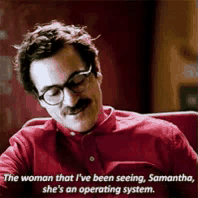
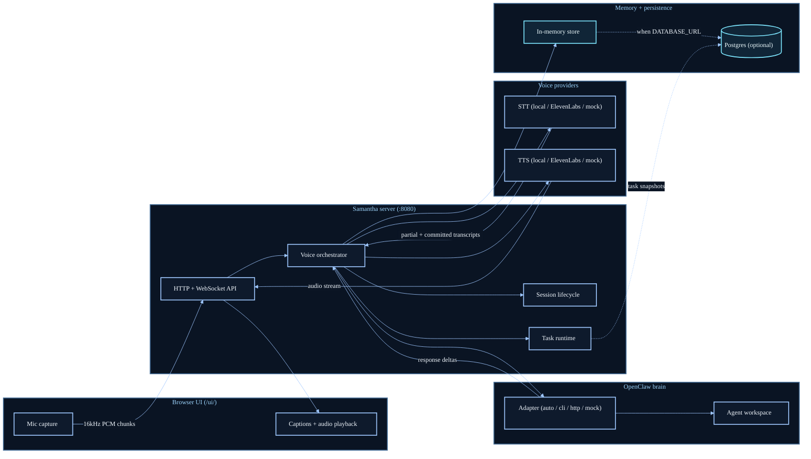

# Samantha

Talk to your computer like you talk to a friend, and let your agents build.

Voice-first companion UI for OpenClaw. Local-first and Apple Silicon friendly.

<div align="center">
  
  <p><strong>Build by voice. Ship at thought speed.</strong></p>
</div>

Samantha is a small Go HTTP/WebSocket server plus a browser UI that does:

`microphone audio` -> `STT` -> `OpenClaw (brain)` -> `streaming TTS` -> `speaker`

If OpenClaw isn't configured, it falls back to a deterministic mock "brain" so you can iterate on the voice loop.

See `docs/ARCHITECTURE.md` for the component map and data flow.
API reference: `docs/API.md`.

## Architecture



## Quickstart (macOS)

```bash
make dev
```

Open:

- `http://127.0.0.1:8080/ui/` (add `?onboarding=1` to rerun first-run checks)

## Configuration

Copy `.env.example` to `.env` and tweak as needed. Key vars:

- `VOICE_PROVIDER=local|auto|elevenlabs|mock` (default `local`)
  - `local`: OSS/offline-first default.
  - `elevenlabs`: use ElevenLabs directly (requires credits/API key).
  - `auto`: prefers ElevenLabs when configured, with automatic runtime fallback to local voice if ElevenLabs session/stream startup fails.
- `APP_SESSION_RETENTION` (ended-session retention window before pruning)
- `APP_STRICT_OUTBOUND` + `APP_WS_BACKPRESSURE_MODE=drop|block`
- `APP_UI_AUDIO_WORKLET` (attempt low-latency AudioWorklet mic capture in `/ui/`, with fallback)
- `APP_ASSISTANT_WORKING_DELAY` (backend delay before emitting `assistant_working`; `0` disables)
- `APP_UI_SILENCE_BREAKER_MODE=off|visual|speech` (dead-air behavior while waiting)
- `APP_UI_SILENCE_BREAKER_DELAY` (delay before silence-breaker triggers after `assistant_working`)
- `APP_UI_VAD_PROFILE=default|patient|snappy` (`patient` waits longest; `snappy` responds sooner)
- `APP_UI_VAD_MIN_UTTERANCE` (minimum utterance before client auto-commit can fire)
- `APP_UI_VAD_GRACE` (extra silence grace before client auto-commit)
- `APP_UI_AUDIO_SEGMENT_OVERLAP` (crossfade overlap between streamed playback segments)
- `APP_FILLER_MODE=off|adaptive|occasional|always` (waiting backchannel policy; `off` is default)
- `APP_FILLER_MIN_DELAY`, `APP_FILLER_COOLDOWN`, `APP_FILLER_MAX_PER_TURN` (anti-spam filler controls)
- `APP_UI_TASK_DESK_DEFAULT` (keep Task Desk hidden by default in core `/ui/`)
- `APP_TASK_RUNTIME_ENABLED`, `APP_TASK_TIMEOUT`, `APP_TASK_IDEMPOTENCY_WINDOW` (voice-to-task runtime)
- `APP_LOCAL_STT_PROFILE=fast|balanced|accurate` (local STT quality/speed preset)
- `APP_LOCAL_STT_AUTO_MODEL_DOWNLOAD` (auto-fetch missing whisper model for selected preset)
- `OPENCLAW_ADAPTER_MODE=auto|cli|http|mock`
- `OPENCLAW_HTTP_URL` (when using `http`)
- `OPENCLAW_HTTP_STREAM_STRICT` (strict streamed JSON validation for OpenClaw HTTP adapter)
- `OPENCLAW_AGENT_ID` (OpenClaw agent id; default `samantha` in `make dev`)
- `OPENCLAW_WORKSPACE_DIR` (override workspace path; for new agents defaults to `~/.openclaw/workspaces/$OPENCLAW_AGENT_ID`)
- `OPENCLAW_CLI_PATH` (when using `cli` or `auto`)
- `OPENCLAW_CLI_THINKING=minimal|low|medium|high` (lower is faster first response; default `minimal`)
- `OPENCLAW_CLI_STREAMING=true|false` (feature-flag incremental CLI text streaming; default `true`)
- `OPENCLAW_CLI_STREAM_MIN_CHARS` (chunking threshold for incremental CLI streaming; default `8`)
- `DATABASE_URL` (optional; enables Postgres-backed memory)
  - Also persists task runtime state (`tasks`, `task_steps`) when task runtime is enabled.

## Voice Backends

- Local (offline, default): whisper.cpp STT + Kokoro TTS (`VOICE_PROVIDER=local`)
  - First run: `make setup-local-voice`
  - Presets: `APP_LOCAL_STT_PROFILE=fast|balanced|accurate` (`balanced` default)
  - If transcripts are still too rough, increase `LOCAL_WHISPER_BEAM_SIZE`/`LOCAL_WHISPER_BEST_OF` or switch to a larger local model.
- ElevenLabs (optional): set `VOICE_PROVIDER=elevenlabs` + `ELEVENLABS_API_KEY`
  - If you want automatic fallback to local when ElevenLabs fails, use `VOICE_PROVIDER=auto`.
  - For lowest-latency playback, keep `ELEVENLABS_TTS_OUTPUT_FORMAT=pcm_16000` (default).
  - If you want the backend to auto-decide when to commit transcripts, set `ELEVENLABS_STT_COMMIT_STRATEGY=vad` (default is `manual`, driven by the UI).

## Brain (OpenClaw)

By default, `make dev` will:

- Attempt to bootstrap OpenClaw auth from your Codex login (if present).
- Ensure a local OpenClaw agent exists (new agents default to `~/.openclaw/workspaces/$OPENCLAW_AGENT_ID`; existing agents keep their configured workspace unless you set `OPENCLAW_WORKSPACE_DIR`).
- Sync the repo’s workspace template in `openclaw/samantha-workspace/` into the active agent workspace each run.

If `openclaw` is not installed/configured, the server runs with a mock brain.

## Performance Loop

- Live latency snapshot API: `GET /v1/perf/latency`
- Generic probe:
  - `make perf-latency`
  - or `INTERVAL_SEC=1 SAMPLES=30 ./scripts/perf_latency_probe.sh http://127.0.0.1:8080`
- Local-first baseline (recommended for milestone gating):
  - `make perf-latency-local`
  - or `FAIL_ON_TARGETS=1 SAMPLES=30 ./scripts/perf_latency_local_baseline.sh http://127.0.0.1:8080`
  - optionally enforce provider check: `REQUIRE_LOCAL_PROVIDER=1 ...`
  - default guardrails: `REQUIRE_SAMPLES=1`, `MIN_STAGE_SAMPLES=5`, `REQUIRE_MIN_STAGE_SAMPLES=1`, `FAIL_EARLY=0`, `RESET_WINDOW=1`
  - autonomous replay is enabled by default (`AUTO_REPLAY=1`): synthetic voice turns are streamed through the same WS audio path
  - disable replay and drive manually with your mic: `AUTO_REPLAY=0 ...`
  - default targets: `assistant_working p95<=650ms`, `first_text p95<=550ms`, `first_audio p95<=1400ms`, `turn_total p95<=3200ms`
